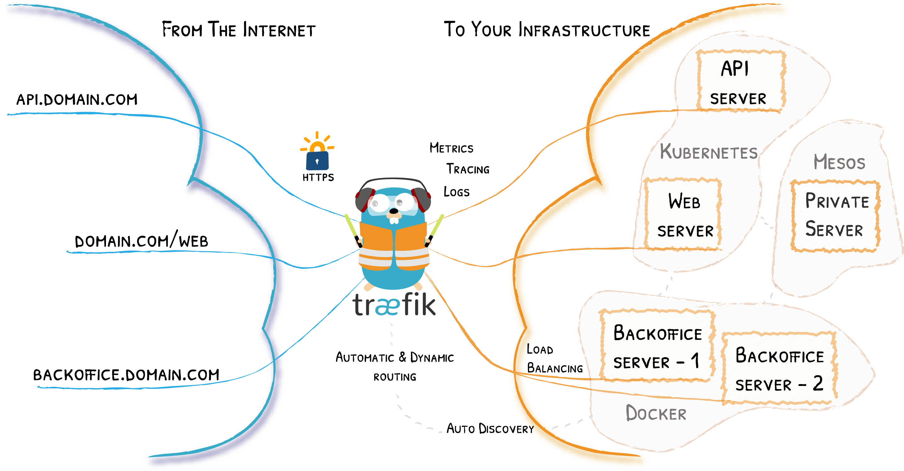
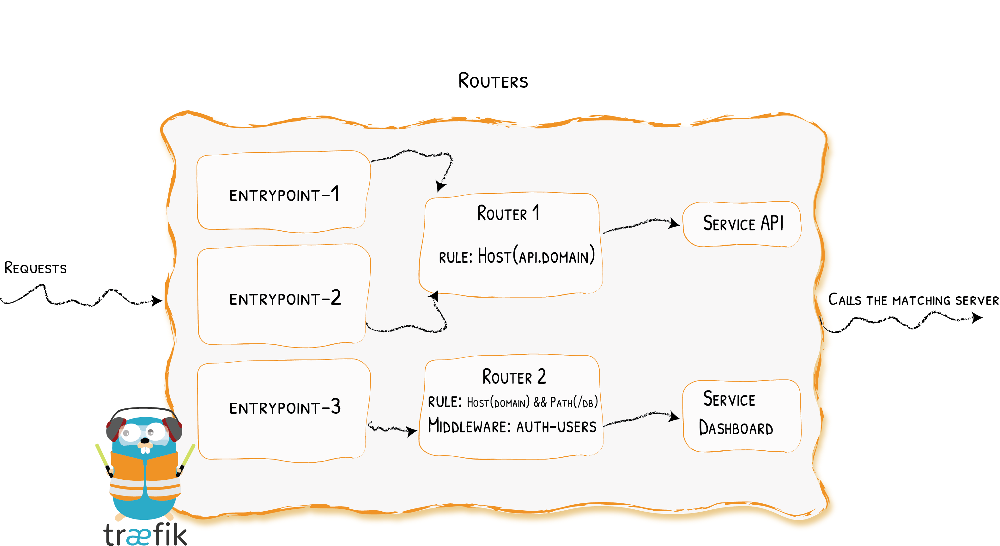
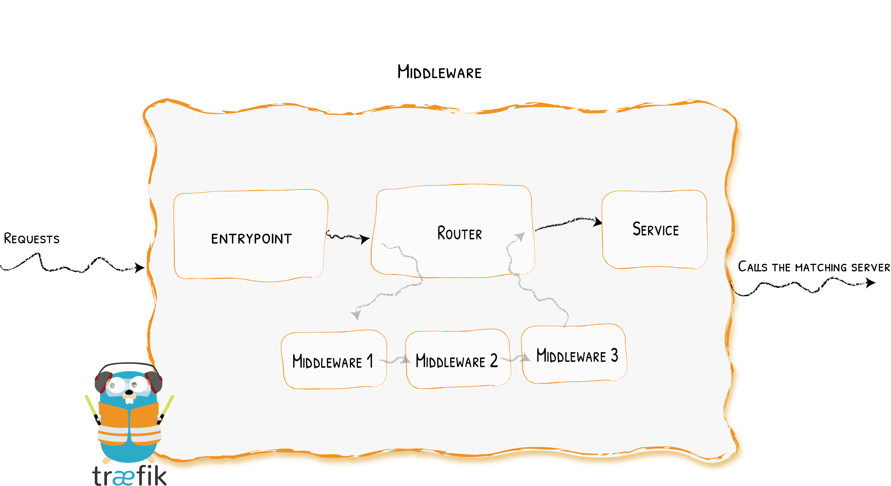
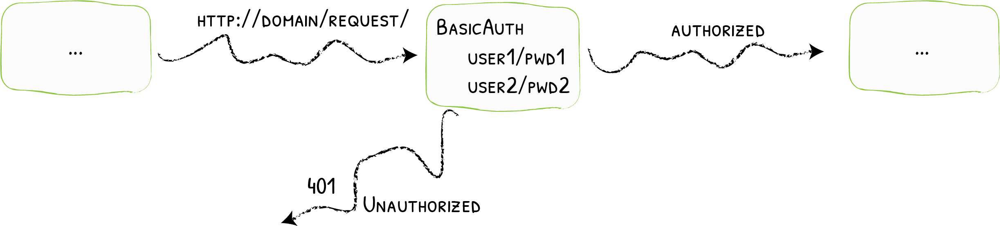

# Coding Dojo - Introduction to Traefik

- [Goals](#goals)
- [Pre-requisite](#pre-requisite)
  - [Knowledge \& Concepts required](#knowledge--concepts-required)
  - [Dev Env requirements](#dev-env-requirements)
    - [Host/VM configuration](#hostvm-configuration)
    - [Recommended IDE Extensions](#recommended-ide-extensions)
    - [Useful links](#useful-links)
- [What is Traefik?](#what-is-traefik)
  - [Definition](#definition)
  - [Use Cases](#use-cases)
  - [Other Highlights](#other-highlights)
- [Architecture](#architecture)
  - [Overview](#overview)
  - [EntryPoints](#entrypoints)
  - [Routers](#routers)
  - [Services](#services)
  - [Middlewares](#middlewares)
  - [Providers](#providers)
    - [Docker](#docker)
    - [Files](#files)
  - [Configuration Samples](#configuration-samples)
- [Demo](#demo)
- [Practice](#practice)
  - [Exercise 01 – Set Up Docker Compose with Traefik Reverse Proxy and Dashboard](#exercise-01--set-up-docker-compose-with-traefik-reverse-proxy-and-dashboard)
  - [Exercise 02 – Map Your First Services Using Traefik Docker Provider \& Labels](#exercise-02--map-your-first-services-using-traefik-docker-provider--labels)
  - [Exercise 03 – Add Rate Limiter \& Authentication Middlewares using File \& Docker Traefik Providers](#exercise-03--add-rate-limiter--authentication-middlewares-using-file--docker-traefik-providers)
  - [Exercise 04 – Secure Traefik Endpoint with a Certificate Signed by a `Fake Coding Dojo Certificate Authority`](#exercise-04--secure-traefik-endpoint-with-a-certificate-signed-by-a-fake-coding-dojo-certificate-authority)
  - [Exercice 05 (Bonus) - Use Case Single Sign On with Authelia](#exercice-05-bonus---use-case-single-sign-on-with-authelia)

## Goals

- Understand what is Traefik.
- See a concrete demonstration of it.
- Practice with exercices using `docker/podman/nerdctl` + `compose` command line.

## Pre-requisite

### Knowledge & Concepts required

We assume you have a basic understanding of the following concepts. If you're not familiar with any of these, you may follow the videos linked below to catch up.

| Knowledge & Concepts                                                       | Tutorial to follow                             |
| ----------------------------------------------------------------------------- | --------------------------------------------------------------- |
| **Docker, Podman, or Nerdctl**: Basic knowledge of containerization tools     | [Docker Tutorial](https://www.youtube.com/watch?v=pg19Z8LL06w)  |
| **Compose**: Familiarity with Compose infrastructure                          | [Compose Tutorial](https://www.youtube.com/watch?v=SXwC9fSwct8) |
| **Proxies and Reverse Proxies**: Understanding of proxies and reverse proxies | [Proxies Tutorial](https://www.youtube.com/watch?v=xo5V9g9joFs) |

### Dev Env requirements

#### Host/VM configuration

- Following requirements must be enabled on your `Host or VM`:
  
  - Virtualization Or/And Nested virtualization in case of VM.
  - `Docker (moby)` or `Podman` or `Nerdctl` installed since `Docker Desktop` requires a licence.
  - `compose` plugin installed for chosen container runtime
  > Verify with `docker compose` or `podman compose` or `nerdctl compose` everything is working

- We will use command `podman` as reference for the coding dojo. Replace by `docker` or `nerdctl` according your container runtime. Or make a session terminal alias with:
  - Linux (bash/sh): `alias docker='podman'`
  - PowerShell: `function docker { podman @Args }`

#### Recommended IDE Extensions

- `VS Code` recommended extensions:
  - [redhat.vscode-yaml](https://marketplace.visualstudio.com/items?itemName=redhat.vscode-yaml)
  - [ms-azuretools.vscode-containers](https://marketplace.visualstudio.com/items?itemName=ms-azuretools.vscode-containers)

#### Useful links

Download links:

- [Docker (moby) via Rancher Desktop](https://rancherdesktop.io/)
- [Podman (+ Desktop)](https://podman.io/)

## What is Traefik?

### Definition

- Traefik is an open-source **Application Proxy** that simplifies the configuration needed to expose your services.
- Unlike traditional proxies, Traefik **automatically discovers configurations**, inspects your infrastructure, and **dynamically maps services to requests**.

### Use Cases

- **Cloud-native applications**: Seamlessly integrate with modern cloud environments.
- **Dynamic service discovery**: Ideal for containerized environments like Docker and Kubernetes.
- **API gateway and traffic management**: Efficiently manage and route API traffic.

### Other Highlights

- **Security**: Act as TLS termination with automatic certificate management and fine-grained access control.
- **Middlewares**: Customize requests and response handling with ease and security.
- **Observability**: Integrated monitoring and logging for better visibility.

> 

## Architecture

### Overview

Traefik receives requests on predefined entrypoints, then routers analyze and match incoming requests, applies middleware transformations if needed before forwarding requests to services.

> 

### EntryPoints

EntryPoints are the network entry points into Traefik. They define the port which will receive the packets, and whether to listen for TCP or UDP.

> 

### Routers

A router is in charge of connecting incoming requests to the services that can handle them.

> 

### Services

The Services are responsible for configuring how to reach the actual services that will eventually handle the incoming requests.

> 

### Middlewares

Attached to the routers, pieces of middleware are a means of tweaking the requests before they are sent to your service (or before the answer from the services are sent to the clients).

> 

- Middlewares Examples:
  
  - **Headers**:
  
    

  - **Basic Auth**:
    
  
  - **Auth Forward**:
  
    

  - **Circuit Breaker**:

    

  - **Ip WhiteList**:

    

  - **Compress**:

    

### Providers

Providers in Traefik are components that define where and how Traefik fetches configuration data. They enable Traefik to discover services, routes, and endpoints dynamically or statically from various sources (Docker socket, Kubernetes, Swarm, Nomad, ...)

#### Docker

Automatically detects running Docker containers and reads their labels to create dynamic routes and services. It uses Docker's API to get container IPs and ports, enabling seamless, real-time service discovery and load balancing without manual config updates.

> 
> 

<https://doc.traefik.io/traefik/routing/providers/docker/>

#### Files

Static files (YAML, TOML, or JSON) to define routers, services, middlewares, and other settings. Useful for predefined configurations or when dynamic discovery isn't required, allowing fine control over Traefik’s behavior.

### Configuration Samples

- Traefik `traefik.yaml` main configuration file sample

```yaml

# Entrypoints definition
entryPoints:
  # Entrypoint for HTTP (port 3080) => > 1024 for rootless purposes
  web:
    address: ":3080"

  # Entrypoint for HTTPS (port 3443) => > 1024 for rootless purposes
  websecure:
    address: ":3443"

# Providers configuration
providers:
  # Docker provider with configuration
  docker:
    # Don't automatically expose all containers
    exposedByDefault: false
    # Watch Docker events
    watch: true

  # File provider for middleware definitions
  file:
    # Directory containing configuration files
    directory: /etc/traefik/file-providers
    # Watch for file changes
    watch: true

# API and dashboard configuration
api:
  # Enable dashboard
  dashboard: true
  # Insecure mode for direct access (development only)
  insecure: true

# Log configuration (optional)
log:
  level: INFO
```

- Traefik `middlewares.yaml` sample (to be loaded via file provider)

```yaml
http:
  middlewares:
    # Rate limiting middleware (very strict settings)
    whoami-rate-limiter:
      rateLimit:
        # Average requests per second (very strict)
        average: 1
        # Maximum burst allowed (very strict)
        burst: 1
        # Period for rate limiting
        period: "1s"
```

- Docker `compose.yaml` sample

```yaml
services:
  traefik:
    image: traefik:v3.6

    # Exposed ports
    ports:
      - "8080:3080" # HTTP (web entrypoint)
      - "8443:3443" # HTTPS (websecure entrypoint)

    # Mounted volumes
    volumes:
      # Map docker socket to monitor containers
      - /var/run/docker.sock:/var/run/docker.sock:ro
      # Traefik configuration
      - ./traefik.yaml:/etc/traefik/traefik.yaml:ro

  # Whoami service
  whoami:
    # Image as specified in requirements
    image: traefik/whoami:v1.11

    # Traefik labels for service discovery
    labels:
      # Enable Traefik for this service
      - "traefik.enable=true"

      # Router configuration
      - "traefik.http.routers.whoami.rule=Host(`whoami.dev.dojo.localhost`)"
      - "traefik.http.routers.whoami.entrypoints=web"
      - "traefik.http.routers.whoami.service=whoami"
      - "traefik.http.routers.whoami.middlewares=whoami-rate-limiter@file" # Apply the middleware named `whoami-rate-limiter@file` to the router

      # Service configuration (whoami runs on port 80 by default)
      - "traefik.http.services.whoami.loadbalancer.server.port=80"
```

## Demo

## Practice

### Exercise 01 – Set Up Docker Compose with Traefik Reverse Proxy and Dashboard

In this exercice you will:

- Init a Docker Compose environment featuring Traefik as the reverse proxy.
- Mount Traefik configuration files and the Docker socket as volumes.
- Define both the `web` and `websecure` Traefik entrypoints.
- Enable access to the Traefik dashboard at [http://localhost:9000](http://localhost:9000).

> Go to [Exercise-01 README.md](./practice/exercise-01/exercise/README.md) to follow this exercice guided.

_Solution of this exercice is under [./practice/exercise-01/solution/](./practice/exercise-01/solution/)._

### Exercise 02 – Map Your First Services Using Traefik Docker Provider & Labels

In this exercice you will:

- Deploy your first services using Podman Compose and Docker labels. Services will be:
  - **whoami** (debug container service):  
    - _Image_: [`traefik/whoami:v1.11`](https://hub.docker.com/r/traefik/whoami)
    - _URL_: [http://whoami.dev.dojo.localhost:8080](http://whoami.dev.dojo.localhost:8080)

  - **open-draw** (Based on [Excalidraw](https://excalidraw.com/) whiteboard without _Marketing Features_, _Analytics_, ...):  
    - _Image_: [`ghcr.io/thomaschampagne/open-draw:latest`](https://github.com/thomaschampagne/open-draw)
    - _URL_: [http://draw.dev.dojo.localhost:8080](http://draw.dev.dojo.localhost:8080)

  - (As Bonus) **Traefik Dashboard**: Access Traefik dashboard through Traefik itself:
    - _URL_:[http://traefik.dev.dojo.localhost:8080](http://traefik.dev.dojo.localhost:8080)
    - _Ports_: Drop `9000:8080` (`host:container`) port mapping.

> Go to [Exercise-02 README.md](./practice/exercise-02/exercise/README.md) to follow this exercice guided.

_Solution of this exercice is under [./practice/exercise-02/solution/](./practice/exercise-02/solution/)._

### Exercise 03 – Add Rate Limiter & Authentication Middlewares using File & Docker Traefik Providers

In this exercice you will:

- Add a rate limiter middleware to the `whoami` service using **Traefik File Provider:**
- Add a basic authentication middleware to the `draw` service with container labels only using **Traefik Docker Provider**

> Go to [Exercise-03 README.md](./practice/exercise-03/exercise/README.md) to follow this exercice guided.

_Solution of this exercice is under [./practice/exercise-03/solution/](./practice/exercise-03/solution/)._

### Exercise 04 – Secure Traefik Endpoint with a Certificate Signed by a `Fake Coding Dojo Certificate Authority`

In this exercice you will:

- Mount a new Traefik TLS configuration file provider.
- Mount a wildcard certificate matching domain `*.dev.dojo.localhost` with the associated private key. Notes:
  - This wildcard certificate is signed by a fake `Fake Coding Dojo Certificate Authority`.
  - No need to generate/sign certificate for this exercice. Files are located into [./practice/exercise-04/exercise/certs/](./practice/exercise-04/exercise/certs/) folder.
- Setup Traefik TLS configuration using the new dedicated file provider.
- Remove non-secure `http` `host:container` port mapping.
- Remove `web` entrypoint for `websecure` use only on services
- Enable `tls` on all services.
- (Bonus) Add Security Headers to All Services (HSTS headers, IFrame injection blocking, Browser XSS filter, ...)

> Go to [Exercise-04 README.md](./practice/exercise-04/exercise/README.md) to follow this exercice guided.

_Solution of this exercice is under [./practice/exercise-04/solution/](./practice/exercise-04/solution/)._

### Exercice 05 (Bonus) - Use Case Single Sign On with Authelia

> No guided exercice for this last exercice

In this exercice you will analyse a `Single Sign On (SSO)` integration over all services endpoints using [Authelia](https://www.authelia.com/) service and Traefik.

- The use case demonstrate:
  - Authentication through <https://auth.dev.dojo.localhost:8443/> web portal of 3 users (`username:password`):
    - `alice:alice` (`users` group)
    - `bob:bob` (`users` group)
    - `admin:admin` (`users` & `admins` groups)

  - Authorization to services:
    - `whoami`: `users` & `admins` groups allowed
    - `draw`: `users` & `admins` groups allowed
    - `traefik`: `admins` group only allowed

- Pay attention to:
  - A `forwardAuth` middleware declared into [./practice/exercise-05/solution/middlewares.yaml](./practice/exercise-05/solution/middlewares.yaml)
  - The matching Authelia configuration [./practice/exercise-05/solution/authelia/config/configuration.yml](./practice/exercise-05/solution/authelia/config/configuration.yml). Focus on following yaml objects:
    - `authentication_backend`
    - `access_control`
    - `session`
  - The static users db @ [./practice/exercise-05/solution/authelia/config/users_database.yml](./practice/exercise-05/solution/authelia/config/users_database.yml). Can be plugged to an AD/LDAP...
  
  - Testing:
    - Open/Authenticate/Access <https://whoami.dev.dojo.localhost:8443/> with `alice:alice` and notice below http headers sent by Traefik once logged:

      ```text
      Remote-Email: alice@dev.dojo.localhost
      Remote-Groups: users
      Remote-Name: Alice In Wonderland
      Remote-User: alice
      ```

      > These headers can be used by an application to authenticate users w/ their group (e.g. sonarqube: <https://docs.sonarsource.com/sonarqube-server/latest/instance-administration/authentication/http-header/>)

    - With `alice:alice` try to access <https://traefik.dev.dojo.localhost:8443/> => should raise `403 Forbidden` as expected.
    - Try to access <https://traefik.dev.dojo.localhost:8443/> with `admin:admin` => should work as expected.

_Solution of this exercice is under [./practice/exercise-05/solution/](./practice/exercise-05/solution/)_
