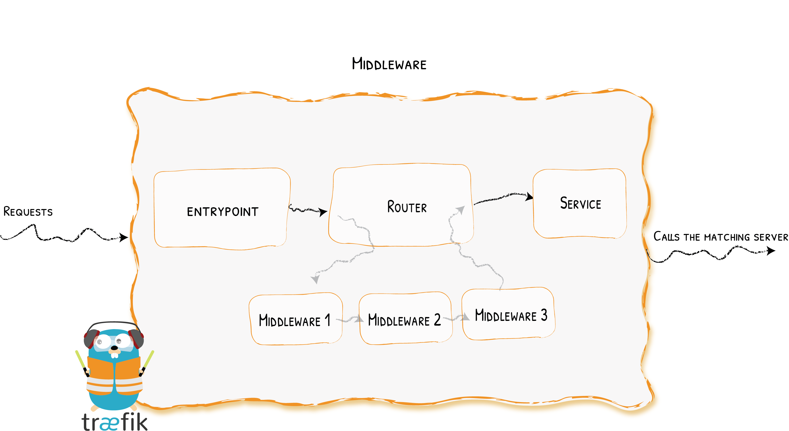
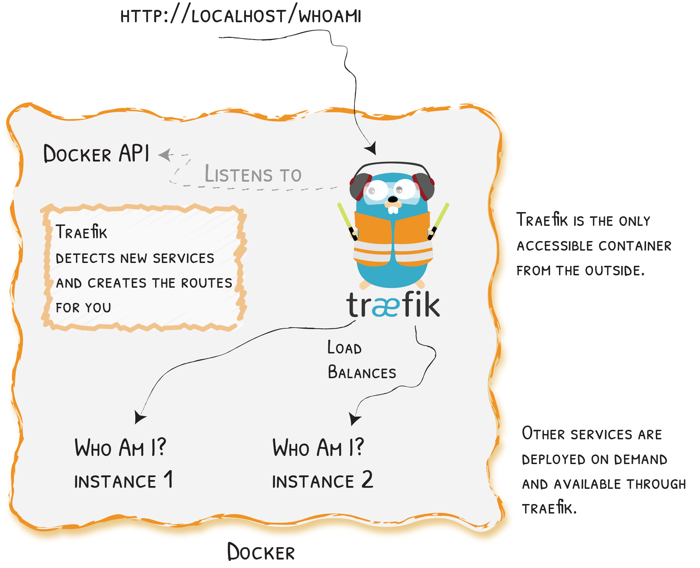
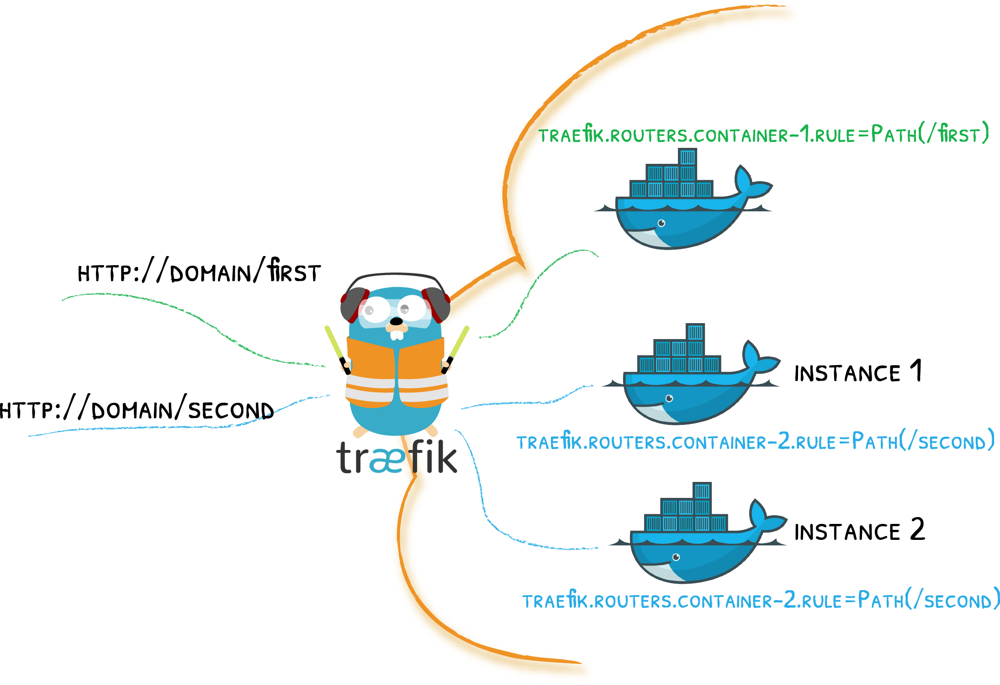

# Coding Dojo - Introduction to Traefik

- [Goals](#goals)
- [Pre-requisite](#pre-requisite)
- [What is Traefik?](#what-is-traefik)
  - [Definition](#definition)
  - [Use Cases](#use-cases)
  - [Other Highlights](#other-highlights)
- [Architecture](#architecture)
  - [Overview](#overview)
  - [EntryPoints](#entrypoints)
  - [Routers](#routers)
  - [Services](#services)
  - [Middlewares](#middlewares)
  - [Providers](#providers)
    - [Docker](#docker)
    - [Files](#files)
- [Demo](#demo)
- [Practice](#practice)
  - [Exercise 01 - Initialize Docker Compose with Traefik Reverse Proxy and Dashboard](#exercise-01---initialize-docker compose-with-traefik-reverse-proxy-and-dashboard)
  - [Exercise 02 – Map Your First Services Using Docker Provider \& Labels](#exercise-02--map-your-first-services-using-docker-provider--labels)

## Goals

- Understand what is Traefik.
- See a concrete demonstration of it.
- Practice with exercices using `docker/podman/nerdctl` + `compose` command line.

## Pre-requisite

- We assume you have a basic knowledge and use of `Docker` or `Podman` or `Nerdctl`

- Following requirements must be enabled on your `Host or VM`:
  
  - Virtualization Or/And Nested virtualization in case of VM.
  - `Docker (moby)` or `Podman` or `Nerdctl` installed since `Docker Desktop` requires a licence.
  - `compose` plugin installed for chosen container runtime
  > Verify with `docker compose` or `podman compose` or `nerdctl compose` everything is working

- We will use command `docker` as reference for the coding dojo. Replace by `podman` or `nerdctl` according your container runtime

- Useful links:
  - [Docker (moby) via Rancher Desktop](https://rancherdesktop.io/)
  - [Podman (+ Desktop)](https://podman.io/)

## What is Traefik?

### Definition

- Traefik is an open-source **Application Proxy** that simplifies the configuration needed to expose your services.
- Unlike traditional proxies, Traefik **automatically discovers configurations**, inspects your infrastructure, and **dynamically maps services to requests**.

### Use Cases

- **Cloud-native applications**: Seamlessly integrate with modern cloud environments.
- **Dynamic service discovery**: Ideal for containerized environments like Docker and Kubernetes.
- **API gateway and traffic management**: Efficiently manage and route API traffic.

### Other Highlights

- **Security**: Act as TLS termination with automatic certificate management and fine-grained access control.
- **Middlewares**: Customize requests and response handling with ease and security.
- **Observability**: Integrated monitoring and logging for better visibility.

> 

## Architecture

### Overview

Traefik receives requests on predefined entrypoints, then routers analyze and match incoming requests, applies middleware transformations if needed before forwarding requests to services.

> 

### EntryPoints

EntryPoints are the network entry points into Traefik. They define the port which will receive the packets, and whether to listen for TCP or UDP.

> 

### Routers

A router is in charge of connecting incoming requests to the services that can handle them.

> 

### Services

The Services are responsible for configuring how to reach the actual services that will eventually handle the incoming requests.

> 

### Middlewares

Attached to the routers, pieces of middleware are a means of tweaking the requests before they are sent to your service (or before the answer from the services are sent to the clients).

> 

### Providers

Providers in Traefik are components that define where and how Traefik fetches configuration data. They enable Traefik to discover services, routes, and endpoints dynamically or statically from various sources (Docker socket, Kubernetes, Swarm, Nomad, ...)

#### Docker

Automatically detects running Docker containers and reads their labels to create dynamic routes and services. It uses Docker's API to get container IPs and ports, enabling seamless, real-time service discovery and load balancing without manual config updates.

> 
> 

<https://doc.traefik.io/traefik/routing/providers/docker/>

#### Files

Static files (YAML, TOML, or JSON) to define routers, services, middlewares, and other settings. Useful for predefined configurations or when dynamic discovery isn't required, allowing fine control over Traefik’s behavior.

## Demo

## Practice

### Exercise 01 - Initialize Docker Compose with Traefik Reverse Proxy and Dashboard

Set up and launch a Docker Compose environment with a Traefik service.

- Mount Traefik configuration files and Docker socket as volumes
- Define Traefik `web` & `websecure` entrypoints
- Permit access to the Traefik dashboard at [http://localhost:9000](http://localhost:9000)

<!-- ### Exercise 01 - Init Compose with Traefik Reverse Proxy And Dashboard

Launch docker compose with Traefik service

- Map Traefik config + socket volumes
- Configure Traefik entrypoints
- Access Traefik dashboard trough <http://localhost:9000>
 -->

### Exercise 02 – Map Your First Services Using Docker Provider & Labels

Set up services using the Docker provider and labels via a `docker compose` file.

Create the following services:

- `whoami` service

  - **Image**: [`traefik/whoami:v1.11`](https://hub.docker.com/r/traefik/whoami)
  - **Access via FQDN**: [http://whoami.dev.dojo.localhost](http://whoami.dev.dojo.localhost)

- `filebrowser` service

  - **Image**: [`filebrowser/filebrowser:v2.42.2`](https://hub.docker.com/r/filebrowser/filebrowser)
  - **Access via FQDN**: [http://files.dev.dojo.localhost](http://files.dev.dojo.localhost)

<!-- ### Exercise 02 - Map your first services using Docker provider & labels

Using Docker provider & labels through `compose` file:

Create:

- `whoami` service:
  - Image: `traefik/whoami:v1.11` (<https://hub.docker.com/r/traefik/whoami>)
  - FQDN Access: <http://whoami.dev.dojo.localhost>

- `filebrowser` service:
  - Image: `filebrowser/filebrowser:v2.42.2` (<https://hub.docker.com/r/filebrowser/filebrowser>)
  - FQDN Access: <http://files.dev.dojo.localhost>
 -->

<!-- - Add <http://fake.api.dev.dojo.localhost> (dummy Json api) -->
<!--  -->
<!-- docker pull filebrowser/filebrowser:v2.42.2 -->
 <!--  -->
 <!-- https://dummyjson.com/ -->
<!--  -->
<!-- - Add whoami service : Configure Traefik labels to access whoami service via a rule <http://whoami.dev.dojo.localhost> -->
<!-- 

COPY FROM BRainstorm

## Practice

### Exercise 01 - Init

Launch docker compose with Traefik service

- Map Traefik config + socket volumes
- Configure Traefik entrypoints
- Access Traefik dashboard at <http://localhost:9000> via port forwarding

Inspire : <https://github.com/thomaschampagne/focale/blob/1.0.0/docker compose.core.yaml>
<https://github.com/thomaschampagne/focale/blob/1.0.0/traefik/traefik.yaml>

### Exercise 02 - First services using docker provider & labels

Using docker provider:

- Add whoami service : Configure Traefik labels to access whoami service via a rule <http://whoami.dev.dojo.localhost>

- Add <http://fake.api.dev.dojo.localhost> (dummy Json api)

### Exercise 03 - Add Rate limiter & basic auth on api (w/ Middlewares)

- Using docker provider:
Add rate limiter middleware on fake api using labels

- Using file provider:
Add Basic auth middleware on fake api (dojo:dojo)

### Exercise 04

TODO : Set a default certificate

### Exercise 05

TODO : Forward auth w/ authelia on whoami
 -->