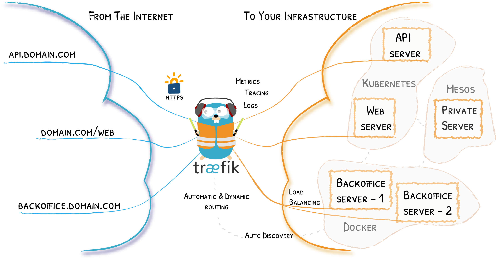
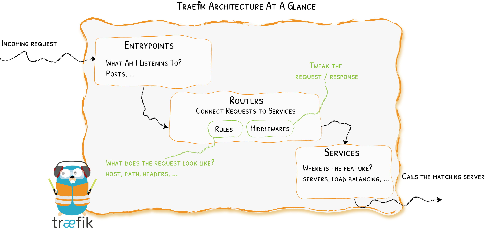
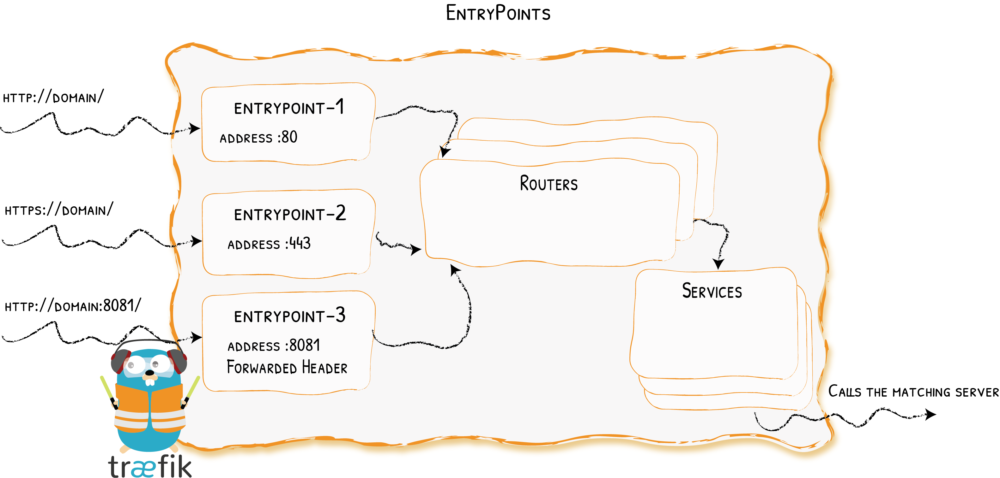
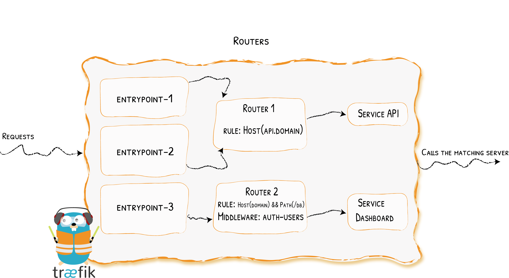
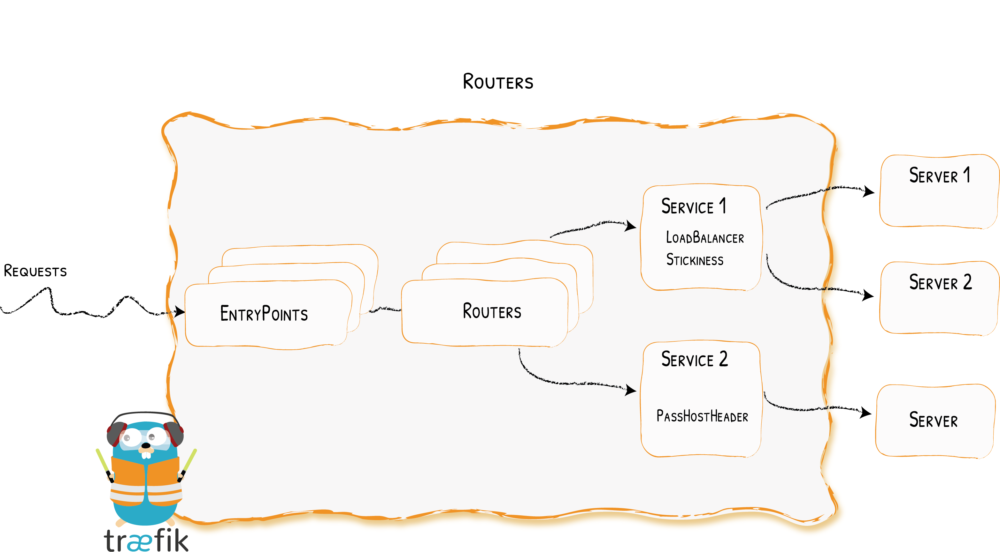

# Coding Dojo - Introduction to Traefik

- [Goals](#goals)
- [Pre-requisite](#pre-requisite)
- [What is Traefik?](#what-is-traefik)
  - [Definition](#definition)
  - [Use Cases](#use-cases)
  - [Other Highlights](#other-highlights)
- [Architecture](#architecture)
  - [Overview](#overview)
  - [EntryPoints](#entrypoints)
  - [Routers](#routers)
  - [Services](#services)
  - [Middlewares](#middlewares)
  - [TODO Providers](#todo-providers)
    - [Docker](#docker)
    - [Files](#files)
- [Demo](#demo)
- [Practice](#practice)

## Goals

- Understand what is Traefik.
- See a concrete demonstration of it.
- Practice with exercices around `docker/podman/nerdctl compose`.

## Pre-requisite

- We assume you have a basic knowledge of `Docker` or `Podman` or `Nerdctl`

- Following requirements must be enabled on your `Machine/VM`:
  
  - Virtualization Or/And nested virtualization
  - `Docker (moby)` or `Podman` or `Nerdctl`
  - `compose` plugin installed for chosen container runtime
  > Verify with `docker compose` or `podman compose` or `nerdctl compose` everything is working

- We will use command `docker` as reference for the coding dojo. Replace by `podman` or `nerdctl` according your container runtime

- Useful links:
  - [Docker (moby) via Rancher Desktop](https://rancherdesktop.io/)
  - [Podman (+ Desktop)](https://podman.io/)

## What is Traefik?

### Definition

- Traefik is an open-source **Application Proxy** that simplifies the configuration needed to expose your services.
- Unlike traditional proxies, Traefik **automatically discovers configurations**, inspects your infrastructure, and **dynamically maps services to requests**.

### Use Cases

- **Cloud-native applications**: Seamlessly integrate with modern cloud environments.
- **Dynamic service discovery**: Ideal for containerized environments like Docker and Kubernetes.
- **API gateway and traffic management**: Efficiently manage and route API traffic.

### Other Highlights

- **Security**: Act as TLS termination with automatic certificate management and fine-grained access control.
- **Middlewares**: Customize requests and response handling with ease and security.
- **Observability**: Integrated monitoring and logging for better visibility.

## Architecture

### Overview

Traefik receives requests on predefined entrypoints, then routers analyze and match incoming requests, applies middleware transformations if needed before forwarding requests to services.

### EntryPoints

EntryPoints are the network entry points into Traefik. They define the port which will receive the packets, and whether to listen for TCP or UDP.

### Routers

A router is in charge of connecting incoming requests to the services that can handle them.

### Services

The Services are responsible for configuring how to reach the actual services that will eventually handle the incoming requests.

### Middlewares

Attached to the routers, pieces of middleware are a means of tweaking the requests before they are sent to your service (or before the answer from the services are sent to the clients).

### TODO Providers

#### Docker

https://doc.traefik.io/traefik/routing/providers/docker/

#### Files

## Demo

## Practice
